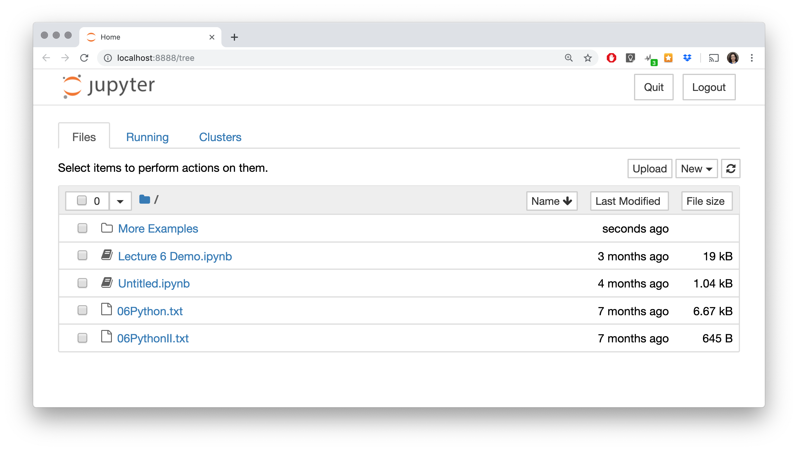
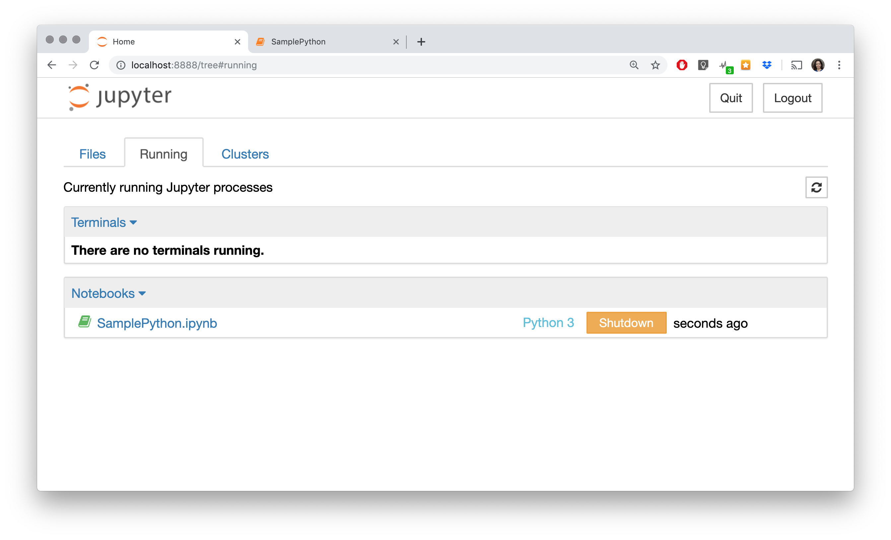

### Why learn Python?
<br>Python is increasingly the most popular choice of programming language for data analysts because it is designed to be simple, efficient, and easy to read and write.
<br>There are many open source software and libraries that use Python and data analysis tools built on them.
<br>We will use Python to learn programming and explore fundamental programming concepts of commands, variables, decisions, repetition, and events.
 
 ### What is Python?
Python is a general, high-level programming language designed for code readability and simplicity.
<br>Python is available for free as open source and has a large community supporting its development and associated tools.
<br>Python was developed by Guido van Rossum and first released in 1991. Python 2.0 was released in 2000 (latest version 2.7), and a backwards-incompatible release Python 3 was in 2008.
<br>􏰀 - Our coding style will be Python 3 but most code will also work for Python 2.
􏰀 <br>- (P.S. the name comes from Monty Python)

### Python Language Characteristics
## Python supports:
􏰀 - dynamic typing
<br>– types can change at run-time
􏰀 <br>􏰀 -multi-paradigm – flexible in that is supports both procedural, object-oriented, and functional styles, for example.
􏰀<br>􏰀 - automatic memory management and garbage collection
<br>􏰀 -􏰀 extensible – other languages such as C/C++ can be used to
<br>􏰀 -compile the code.
<br>􏰀 -􏰀 and more ...
 

### Python Language Characteristics
## Python core philosophies (by Tim Peters) 􏰀 Beautiful is better than ugly
􏰀<br>􏰀 - Explicit is better than implicit
􏰀<br>􏰀 - Simple is better than complex
􏰀<br>􏰀 - Complex is better than complicated 􏰀 Readability counts
 
###  Some Quotes
If you can’t write it down in English, you can’t code it.
<br>— Peter Halpern
<br>I really hate this damn machine. I wish that I could sell it.
<br>I never does quite what I want. Just only what I tell it.
<br>— programmers lament
 

### Introduction to Programming
Recall. . .
<br>An algorithm is a precise sequence of steps to produce a result. A program is an encoding of an algorithm in a language to solve a particular problem.
<br>There are numerous languages that programmers can use to specify instructions. Each language has its different features, benefits, and usefulness.
<br>The goal is to understand fundamental programming concepts that apply to all languages.

### Installing and Using Python
Follow this guide on getting Python 3 on your computer (or this guide, or this guide (for Macs), or countless others you might find on the internet).
<br>Another way you can get python is through Anaconda (recommended).
􏰀 <br>- See this help video (Windows) 􏰀 <br>-See this help video (Mac)
 

### Python: Basic Rules
􏰀
<br>-To program in Python you must follow a set of rules for specifying your commands. This set of rules is called a syntax.
<br>-􏰀 Just like any other language, there are rules that you must follow if you are to communicate correctly and precisely.
<br>-For a more thorough overview of Python, you may have a look at Python Essential Reference by David Beazley as well as countless website online, eg w3schools, codeacademy, . . .
<br>-Other useful resources include: documentation for Python 3.7.3, Python.org (getting started), and the Pep 8 style guide.
􏰀


### Python: Basic Rules
<br>-Important general rules of Python syntax:
<br>-􏰀 Python is case-sensitive.
<br>-􏰀 Python is particular on whitespace and indentation.
<br>-􏰀 The end of command is the end of line (i.e semi-colons are not a required terminator).
􏰀<br>- Use four spaces for indentation whenever in a block.
􏰀<br>- Spaces are the preferred indentation method.
<br>-􏰀 Tabs should be used solely to remain consistent with code that is already indented with tabs.
􏰀 <br>-Python 3 disallows mixing tabs and spaces for indentation.
```text
 def spam(): 
   eggs = 12
   return eggs
print spam()
```


### Comments
Comments are used by the programmer to document and explain the code. Comments are ignored by the computer.
<br>Type # before the comment and any characters to the end of line are ignored by the computer. Example:
 ``` text
 # Single line comment
 print (1)  # Comment at end of line
 ```

### Python Programming
<br>A Python program, like a book, is read left to right and top to bottom. Each command is on its own line.
```text
# Sample Python program
name = "Joe" print("Hello") 
print("Name: "+name)
```
<br>A user types in a Python program in a text editor (some examples) or integrated development environment (IDE examples).
<br>To run the program we need a Python interpreter (i.e. a program that reads Python programs and carries out their instructions).
 
 ### Installing and Using Python

<br>You may already have a version of python on your computer. You can check by opening the command window/terminal and
<br>typing py/python (Windows/Mac).
<br>To exit using Python in the console type Ctrl + keystrokeZ then
<br>ENTER (if using Windows) or Ctrl + keystrokeD on a Mac.
<br>Alternatively, you could also run the python command exit().
<br>Read more about running python through the console here.
<br>You could also use one of the various online Python 3 compilers for example.
  
### Installing and Using Python
<br>Python version
<br>If you haven’t done any of the installations above, this is probably going to be Python 2.

<br>You can find out which version of Python you have by typing python -V in your console.
 

### Python Editor - Jupyter
<br>“Project Jupyter exists to develop open-source software, open-standards, and services for interactive computing across dozens of programming languages.”
<br>Jupyter notebook is a graphical, browser-based application for editing and running Python. Follow the instructions here to install.
<br>To run, type jupyter notebook in your Command Prompt. This action will start the notebook server in your default browser
and echo information about the notebook server in your terminal. <br>Read more about it by clicking Try Jupyter for Python here

### Python Editor - Jupyter
<br>The Notebook Dashboard will list all of the notebooks (.ipynb), files, and subdirectories stored in the local working directory (i.e. the directory from which you launched jupyter)


### Python Editor - Jupyter
<br>To create anew notebook, select New, Python3.


### Python Editor - Jupyter
<br>To close this program, navigate the the <b> Running</b> tab and click the orange Shutdown button. Closing the notebook's page is  not sufficient to shutdown.


