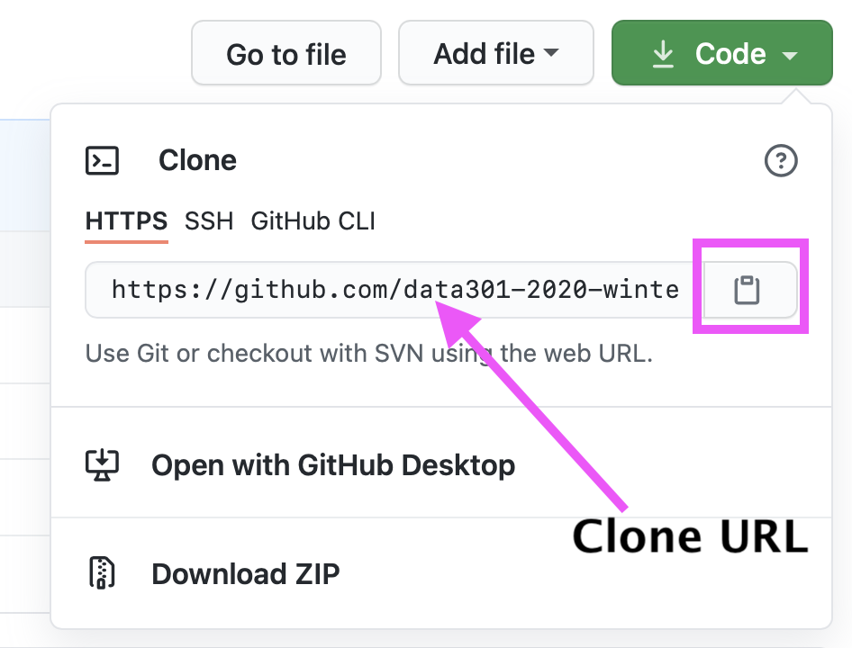

# Class 1B: Data Science Tech Stack

## "Who's in class" survey

Hello! And welcome to my class.

It is important to me that the welcome above, is not just words. I strive to make all of my classes as inclusive as possible given my time and workload constraints. There is always room to improve. To try and focus some of my energies, I'd like to collect some data about who is in my class, so I can try to make some more targeted adjustments and improvements.

This form gives you the opportunity to share aspects of your social identity and other attributes that can help your instructor know how to better support overall learning in this course.

The information collected will be used to help foster an inclusive and equitable classroom and is completely anonymous, and optional.

Please be aware, it is not required for you to complete this form, and that you are not obligated in any way to complete this! There is no extra credit, or penalties associated with completing or not completing the form.

Note: If you are enrolled in multiple classes with me, you may want to fill this out multiple times because your answers may be different depending on the class you're taking!

```{card} Who's in Class survey (anonymous)
:link: https://ubc.ca1.qualtrics.com/jfe/form/SV_7Oi7FwTWO2N5gMK?course=data301&term=2022_WT2

Click here to access the survey and complete it anonymously.
```

## Logistics

At the start of class, 

During class we will go through some logistics, and then go through the Data Science Tech Stack to explain all the programs and software we will be installing.

### Introduction to Gradescope

In a course like this, it is essential for us to have a smooth process to deliver feedback to you as quickly and efficiently as possible.

#### Why are we using Gradescope?

- Tried to do this just on Canvas in the past, it has HUGE efficiency issues for grading (doesn't allow simultaneous grading, slow, painful, etc...).
- Gradescope has GitHub integration and support for displaying Jupyter Notebooks natively, Canvas does not.
- Gradescope is better at allowing us to provide higher quality feedback more efficiently to students.
- There are a couple of issues with Gradescope, specifically with students "seeing" the feedback we give, and "resubmissions".
- Students don't seem to mind it 🤷🏽‍♂️.

#### How to see your feedback

I've created a gif for you to see how you can see your feedback.

```{figure} images/Gradescope_feedback.gif
---
height: 450px
name: PAT
---
View your feedback on Gradescope
```

### Demo of Ed Discussion

```{card} Request an invite to Ed Discussion using a non-UBC email
:link: https://ubc.ca1.qualtrics.com/jfe/form/SV_bjBcTik01NqJ9A2?course=data301&term=2022_WT2

If you have been unsuccessful using your UBC email address to join Ed Discussion, you may provide an alternate email address here.
```

## Tour of Visual Studio Code

VS Code (or Visual Studio Code) is the IDE, or "Interactive Development Environment" we will be using in this course.
Though it is not required for you to use it (you can accomplish the same things in other IDEs like PyCharm, Atom, etc...), I suggest giving it a shot and see how you like it!
In this live demo, I'll show you around the editor and how you can use it for your work:

- Opening a Folder vs. opening an individual file
- Opening a Terminal in VS Code
    - On Windows, you may need to do an extra step to link your GitBash terminal to VS Code
- Sidebar for files
- Search
- Extensions
- Customizing colours, editor layout, other settings

## Accept your first lab

The first thing you will generally need to do when a lab is released is to "accept it".
This means that you'll get a "copy" of the lab instructions and the folder where you are meant to do work.

- You will find the link to accept the lab on Canvas, under "Course Content ▶ GitHub Classroom Links".


Just click on the "Accept Lab" link, and it will take you to the page on GitHub.com where you will complete your lab.

```{important}
For some labs clicking the link will take you to an intermediate page where you'll be asked to wait till your "repository" is being created. Just be patient for a few seconds, and once it's done you should reload and the repository will be there for you. This whole process shouldn't take longer than 30 seconds.
```
- You can get your "Clone URL" from GitHub:



## Introduction to Markdown

- What is Markdown?
- Key Features of Markdown
- Why use Markdown?
- Key Limitations of Markdown
- Visual Studio Code Markdown Preview
- [Markdown Cheat Sheet](https://www.markdownguide.org/cheat-sheet/)

## Learning Log 1

Learning Log 1 will be available to you after the last class of the week is over.

```{important}
That's it, see you next week! Remember to continue working on the "Setup" of your machines and visit the labs to get extra help!
```