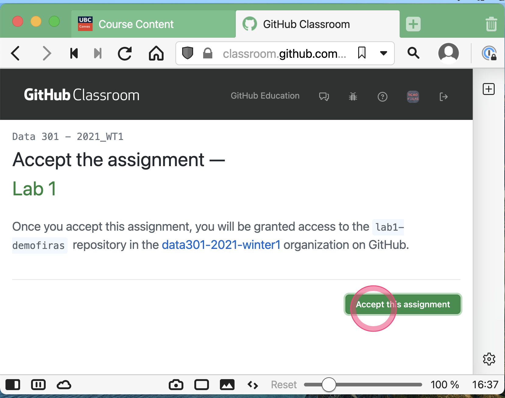
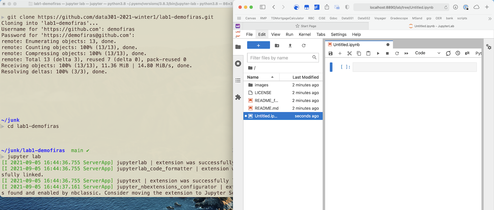

# Task 1 - Set up your computer

First, you should follow the [install instructions on the course website](https://firas.moosvi.com/courses/2021_WT1/data301/notes/setup/stack.html#).

Below are the instructions for you to continue installing software on your system. We will need this for the first python lecture this week.

- [macOS](https://firas.moosvi.com/courses/2021_WT1/data301/notes/setup/install_ds_stack_mac.html)
- [Windows](https://firas.moosvi.com/courses/2021_WT1/data301/notes/setup/install_ds_stack_windows.html)

## Getting Started

Once you are done with the install instructions, you can get started with the rest of Lab 1.

## Task 1.1: Accept the lab assignment
You can find the link to accept the lab on Canvas, under "Course Content" and then "Lab Links and Solutions".

- You can get your clone URL from GitHub:


## Task 1.2: Use the clone URL and clone the Lab 1 repository on your local computer and navigate to that directory

- Open a new Terminal - when you do, generally you will start in your home directory (on Windows this will be `C:\Users\yourusername\` and on macOS and Ubuntu this wil be `/Users/yourusername`). You can check your home directory by typing `pwd` (print working directory) and hitting enter.


- To navigate to a new directory, you will need to use the `cd` command and use tab-completion to find the directory on your computer where you cloned this lab:

```
cd ~/school/year3/data301/lab1-github-username
```
**Note: you may choose a different directory structure, based on how you keep your coursework organized on your machine. If you do not currently organize your coursework in a particular way, I suggest using the structure above.

- You will then need to clone the GitHub repository somewhere locally (I suggest a directory structure like the one I above):

```
git clone https://github.com/data301-2021-winter1/lab1-YOUR_USER_NAME.git
```



## Task 1.3: Add, commit, and push your changes to GitHub

Once you are done cloning `Lab1` and have completed the installation instructions, you will need to include a screenshot of a Terminal window, running a Jupyter Lab session locally on your computer, with a Python 3 kernel to get full marks for this portion.

Add the screenshot to the repository (in the main `Lab1` directory is fine).
Here is an example of the type of screenshot we are looking for.
Your screenshot must include:

A) a Terminal (GitBash on Windows) window showing you cloning your repository AND
B) running `jupyterlab` AND 
C) A new Python notebook (click on "Python" to create a new Python notebook).



Remember to adjust the name of your screenshot file (it should match exactly, including the extension. Mine is `.png`, yours could be a jpg, or bmp or tiff) and add your own commit message):

```
git add screenshot.png
git commit -m "Added Jupyter Lab screenshot"
git push
```

Onwards to [Task 2](./Task2.md)!